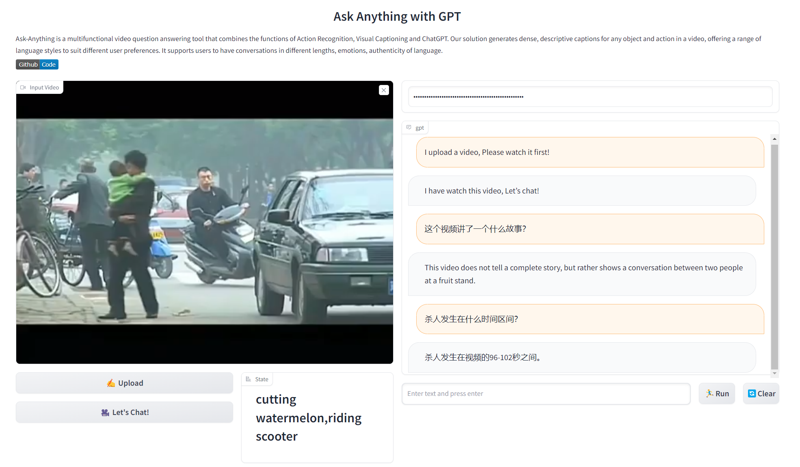

# Ask-Anything [Long-Term Video]

[中文](README_cn.md) | [Demo](https://yinanhe.github.io/projects/chatvideo.html)

A new branch for Watch videos longer than one minute with chatGPT.


# :fire: Updates

- 2023/04/28 Add whisper into our Ask-Anything for long-term video.

- 2023/04/25 Watch videos longer than one minute with chatGPT
  - [VideoChat_LongVideo](https://github.com/OpenGVLab/Ask-Anything/tree/long_video_support/video_chat): Update langchain to the latest version.


# :speech_balloon: Example



# :running: Usage

```shell
# We recommend using conda to manage the environment and use python3.8.16
conda create -n chatvideo python=3.8.16
conda activate chatvideo

# Clone the repository:
git clone -b long_video_support  https://github.com/OpenGVLab/Ask-Anything.git
cd ask-anything/video_chat

# Install dependencies:
pip install -r requirements.txt
pip install https://github.com/explosion/spacy-models/releases/download/en_core_web_sm-3.0.0/en_core_web_sm-3.0.0.tar.gz
python -m pip install 'git+https://github.com/facebookresearch/detectron2.git'

# Download the checkpoints
wget https://huggingface.co/spaces/xinyu1205/Tag2Text/resolve/main/tag2text_swin_14m.pth ./pretrained_models/tag2text_swin_14m.pth
wget https://datarelease.blob.core.windows.net/grit/models/grit_b_densecap_objectdet.pth ./pretrained_models/grit_b_densecap_objectdet.pth
git clone https://huggingface.co/mrm8488/flan-t5-large-finetuned-openai-summarize_from_feedback ./pretrained_models/flan-t5-large-finetuned-openai-summarize_from_feedback

# Configure the necessary ChatGPT APIs
export OPENAI_API_KEY={Your_Private_Openai_Key}

# Run the VideoChat gradio demo.
python app.py
```

# Acknowledgement

The project is based on [InternVideo](https://github.com/OpenGVLab/InternVideo), [Tag2Text](https://github.com/xinyu1205/Tag2Text), [GRiT](https://github.com/JialianW/GRiT), [mrm8488](https://huggingface.co/mrm8488/flan-t5-large-finetuned-openai-summarize_from_feedback) and [ChatGPT](https://openai.com/blog/chatgpt). Thanks for the authors for their efforts.


