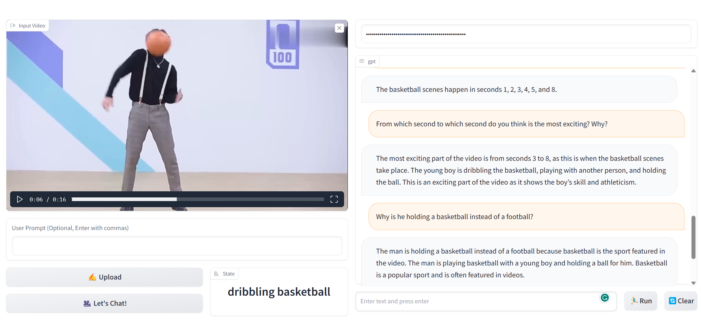

# VideoChat

VideoChat is a multifunctional video question answering tool that combines the functions of Action Recognition, Visual Captioning and ChatGPT. Our solution generates dense, descriptive captions for any object and action in a video, offering a range of language styles to suit different user preferences. It supports users to have conversations in different lengths, emotions, authenticity of language.
- Video-Text Generation
- Chat about uploaded video
- Interactive demo

# :fire: Updates

- **2023/04/19**: Code Release

# :speech_balloon: Example




# :running: Usage

```shell
# Clone the repository:
git clone ask-anything.git
cd ask-anything/video_chat

# Install dependencies:
pip install -r requirements.txt

# Download the checkpoints
wget https://huggingface.co/spaces/xinyu1205/Tag2Text/resolve/main/tag2text_swin_14m.pth ./pretrained_models/tag2text_swin_14m.pth
wget wget https://datarelease.blob.core.windows.net/grit/models/grit_b_densecap_objectdet.pth ./pretrained_models/grit_b_densecap_objectdet.pth
git clone https://huggingface.co/mrm8488/flan-t5-large-finetuned-openai-summarize_from_feedback pretrained_models/flan-t5-large-finetuned-openai-summarize_from_feedback

# Configure the necessary ChatGPT APIs
export OPENAI_API_KEY={Your_Private_Openai_Key}

# Run the VideoChat gradio demo.
python app.py
```

# Acknowledgement

The project is based on [InternVideo](https://github.com/OpenGVLab/InternVideo), [Tag2Text](https://github.com/xinyu1205/Tag2Text), [GRiT](https://github.com/JialianW/GRiT), [mrm8488](https://huggingface.co/mrm8488/flan-t5-large-finetuned-openai-summarize_from_feedback) and [ChatGPT](https://openai.com/blog/chatgpt). Thanks for the authors for their efforts.

