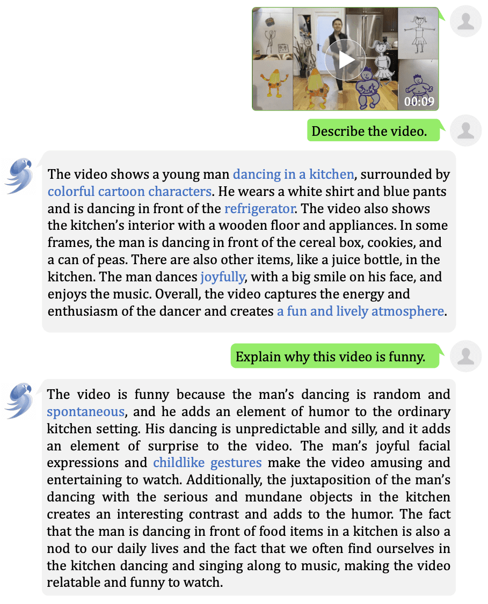
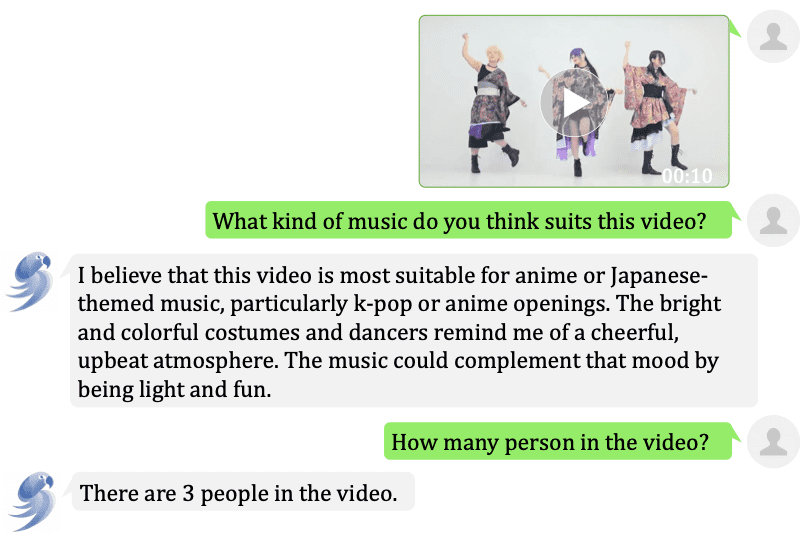
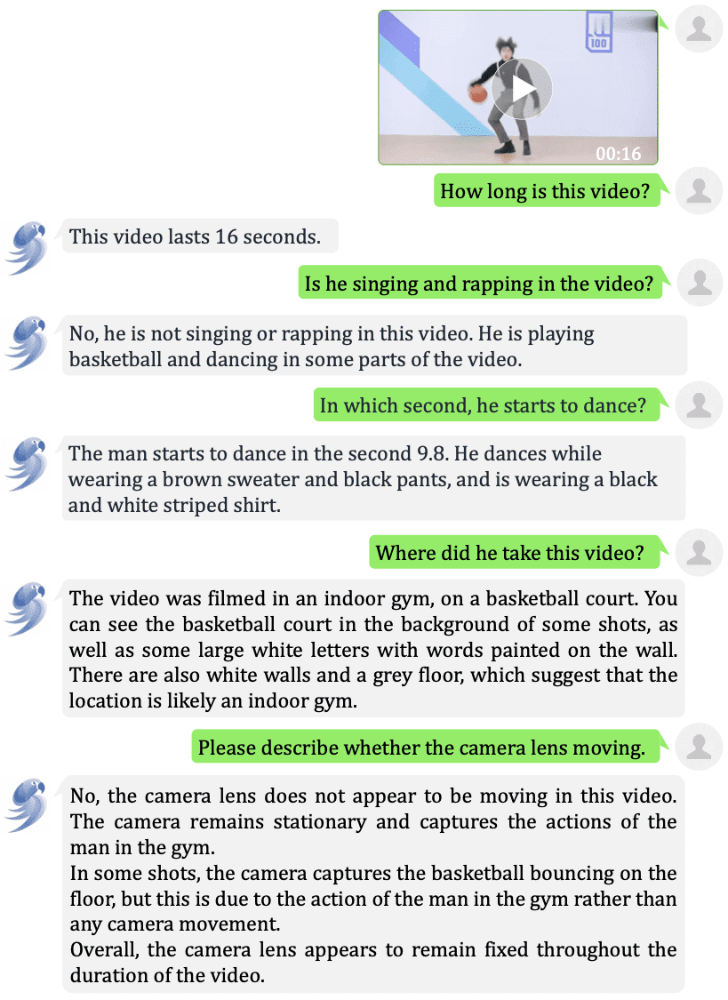
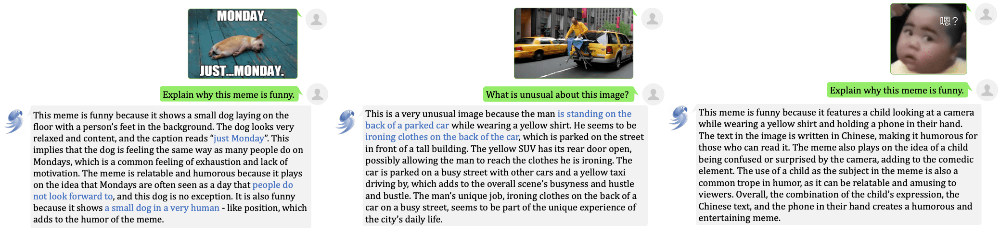

# 🦜 VideoChat [[论文](https://arxiv.org/abs/2305.06355)/[demo](https://vchat.opengvlab.com/)]


我们提出了VideoChat，一个以聊天为中心的视频理解系统，开展了探索性的视频理解研究。
它通过一个可学习的接口将视频预训练模型和大语言模型结合在一起，擅长于空间-时间推理、事件定位和因果关系推断。
为了有指导性地训练这个模型，我们提出了一个视频为中心的Instruction数据集，由数千个视频和详细描述及对话组成。
该数据集强调空间-时间推理和因果关系，为训练以聊天为中心的视频理解系统提供了训练数据。
初步的实验展示了我们系统在广泛的视频应用中的潜力。

## 🔥 更新
- **2023/11/29** VideoChat2和MVBench发布:
  - [VideoChat2](./video_chat2/)是基于[UMT](https://github.com/OpenGVLab/unmasked_teacher)和[Vicuna-v0](https://github.com/lm-sys/FastChat/blob/main/docs/vicuna_weights_version.md)构建的强大基线
  - **1.9M** 多样[指令数据](./video_chat2/data.md)以便有效调优
  - [MVBench](./video_chat2/MVBench.md)是一个全面的视频理解基准
- **2023/06/09**: 发布代码和训练微调脚本:
    - 直接运行 [scripts](./scripts)，比如 `bash ./exp/run_7b_stage1.sh`.
    - 你可以自行修改 `NNODE` 或者 `MASTER_NODE`。对于第一阶段，至少需要8个GPU来快速训练。对于第二阶段，4个GPU足够。
- **2023/05/12**: 发布**7B**版本：
   - 🎊 [**模型-7B**](https://drive.google.com/file/d/1C4s65TC5Zr85I8dZmnfrrw6oDAjj1H4P/view?usp=sharing)：7B版本需要约**20GB的GPU内存**，而13B版本需要约32GB的GPU内存。
- **2023/05/11**: 发布**🦜VideoChat V1**版本，可以**处理图像和视频理解**！
   - 🎊 [**模型-13B**](https://drive.google.com/file/d/1BqmWHWCZBPkhTNWDAq0IfGpbkKLz9C0V/view?usp=share_link) and [**数据**](https://github.com/OpenGVLab/InternVideo/tree/main/Data/instruction_data).
   - 🤗 [**在线演示Demo**](https://vchat.opengvlab.com/)

## :hourglass_flowing_sand: 计划

- [x] 小规模视频Instruction数据和训练
- [x] 在BLIP+UniFormerV2+Vicuna上进行训练
- [ ] 大规模和复杂的视频Instruction数据
- [ ] 在更强视频基础模型上进行Instruction训练
- [ ] 与更长的视频进行友好的交互
- [ ] …

## :speech_balloon: 示例 [在线体验🦜](https://vchat.opengvlab.com/)

<div align="center">
<b>
  <font size="4">与ChatGPT、MiniGPT-4、LLaVA和mPLUG-Owl的比较。</font>
  <br>
  <font size="4" color="red">我们的VideoChat可以较好地处理图像和视频理解！</font>
</b>
</div>
<div align="center">

</div>


<div align="center">
  <font size="4">
	<a href="https://pjlab-gvm-data.oss-cn-shanghai.aliyuncs.com/papers/media/jesse_dance.mp4">[Video]</a> <b>为什么这个视频很有趣？b>
  </font>
</div>
<div align="center">

</div>

<div align="center">
  <font size="4">
	<a href="https://pjlab-gvm-data.oss-cn-shanghai.aliyuncs.com/papers/media/jp_dance.mp4">[Video]</a> <b>空间感知</b>
  </font>
</div>
<div align="center">

</div>

<div align="center">
  <font size="4">
	<a href="https://pjlab-gvm-data.oss-cn-shanghai.aliyuncs.com/papers/media/car_accident.mp4">[Video]</a> <b>时间感知</b>
  </font>
</div>
<div align="center">

</div>

<div align="center">
  <font size="4">
	<a href="https://pjlab-gvm-data.oss-cn-shanghai.aliyuncs.com/papers/media/idol_dancing.mp4">[Video]</a> <b>多轮对话</b>
  </font>
</div>
<div align="center">

</div>

<div align="center">
  <font size="4">
	<b>图像理解</b>
  </font>
</div>
<div align="center">

</div>
  
## :running: 使用方法

### Linux 环境
- 准备环境.
  1) 建议在conda环境下进行安装 （可选）
  ```
  conda create -n videochat python=3.8
  conda activate videochat
  ```
  2) 安装python环境
    ```shell
    pip install -r requirements.txt
    ```
  3) 下载预训练模型  
  
  - 下载[BLIP2](https://huggingface.co/docs/transformers/main/model_doc/blip-2) model:
    ```
    mkdir model
    wget -P ./model/ https://storage.googleapis.com/sfr-vision-language-research/LAVIS/models/BLIP2/eva_vit_g.pth 
    wget -P ./model/ https://storage.googleapis.com/sfr-vision-language-research/LAVIS/models/BLIP2/blip2_pretrained_flant5xxl.pth
    ```
    - 如果您修改了下载的地址，您需要修改 `vit_model_path` and `q_former_model_path` in [config.json](./configs/config.json) or [config_7b.json](./configs/config_7b.json).
    
  - 下载[StableVicuna](https://huggingface.co/CarperAI/stable-vicuna-13b-delta)模型：
      -  您需要从[llama github](https://github.com/facebookresearch/llama) 或 [huggingface](https://huggingface.co/decapoda-research/llama-13b-hf) 下载预训练权重
      - **如果您是从llama github中下载的LLAMA，请先对权重进行预处理**
      ```shell
         # convert_llama_weights_to_hf is copied from transformers
          python src/transformers/models/llama/convert_llama_weights_to_hf.py \
          --input_dir /path/to/downloaded/llama/weights \
          --model_size 13B --output_dir /output/path
      ```
      - 下载13B的 [stable-vicuna-13b-delta](https://huggingface.co/CarperAI/stable-vicuna-13b-delta)并处理:
      ** 请注意，这可能需要30G以上的GPU显存，如果您有24G显存的GPU，请下载下面的7B模型 **
      ```shell
      # fastchat v0.1.10
      python3 apply_delta.py \
        --base {llama-13b的模型路径} \
        --target stable-vicuna-13b \
        --delta CarperAI/stable-vicuna-13b-delta
      ```
      - 下载7B的 [vicuna-7b-delta-v0](https://huggingface.co/lmsys/vicuna-7b-delta-v0)并处理：
        ```shell
        # fastchat v0.1.10
        python3 apply_delta.py \
          --base  {llama-7b的模型路径} \
          --target vicuna-7b-v0 \
          --delta lmsys/vicuna-7b-delta-v0
        ```
        - Change the `llama_model_path` in [config.json](./configs/config.json) or [config_7b.json](./configs/config_7b.json).
  
      -  下载[VideoChat-13B](https://drive.google.com/file/d/1BqmWHWCZBPkhTNWDAq0IfGpbkKLz9C0V/view?usp=share_link) or [VideoChat-7B](https://drive.google.com/file/d/1C4s65TC5Zr85I8dZmnfrrw6oDAjj1H4P/view?usp=sharing):
	
         - Change the `videochat_model_path` in [config.json](./configs/config.json)or [config_7b.json](./configs/config_7b.json).
        
    4) 开始运行demo
      ```shell
        python demo.py
	```
	
    5) 打开 127.0.0.1:7860 开始体验~
  
    6) [可选] 我们也提供了Jupyter Notebook 的demo
  
  # :page_facing_up: 引用

如果您觉得这个项目对您有帮助，请考虑引用我们：
```BibTeX
@article{2023videochat,
  title={VideoChat: Chat-Centric Video Understanding},
  author={KunChang Li, Yinan He, Yi Wang, Yizhuo Li, Wenhai Wang, Ping Luo, Yali Wang, Limin Wang, and Yu Qiao},
  journal={arXiv preprint arXiv:2305.06355},
  year={2023}
}
```
  
 # :thumbsup: 致谢

感谢以下开源数据:

[InternVideo](https://github.com/OpenGVLab/InternVideo), [UniFormerV2](https://github.com/OpenGVLab/UniFormerV2), [MiniGPT-4](https://github.com/Vision-CAIR/MiniGPT-4), [LLaVA](https://github.com/haotian-liu/LLaVA), [BLIP2](https://huggingface.co/docs/transformers/main/model_doc/blip-2), [StableLM](https://github.com/Stability-AI/StableLM).
  
