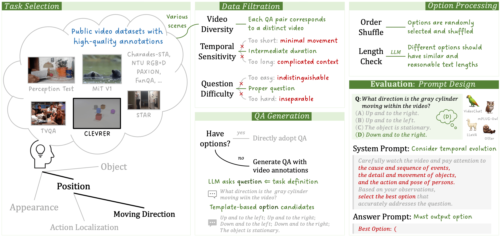
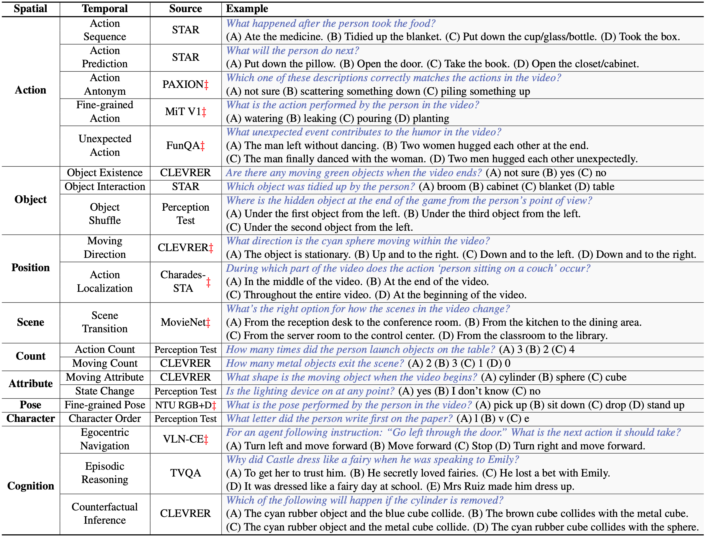
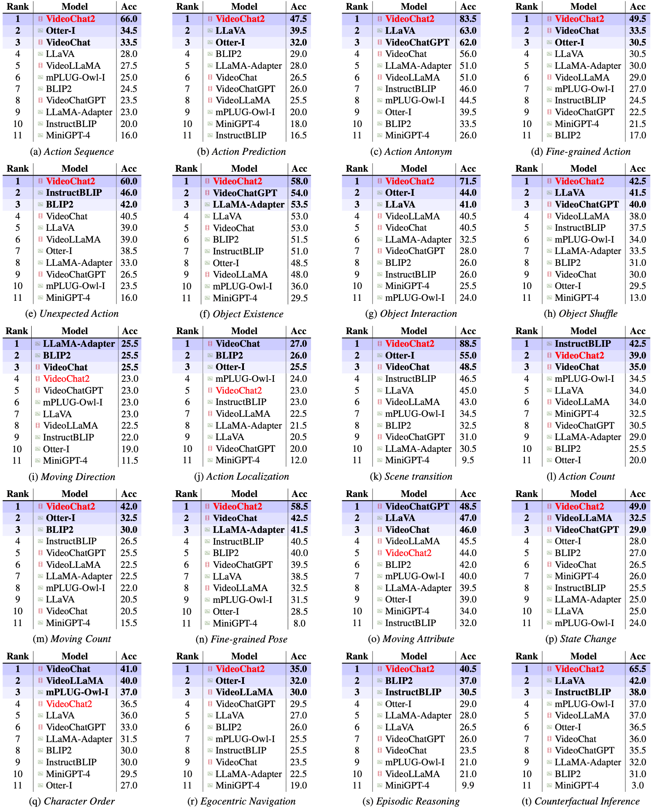

# MVBench

We introduce a novel static-to-dynamic method for defining temporal-related tasks. By converting static tasks into dynamic ones, we facilitate systematic generation of video tasks necessitating a wide range of temporal abilities, from perception to cognition. Guided by task definitions, we then **automatically transform public video annotations into multiple-choice QA** for task evaluation. This unique paradigm enables efficient creation of MVBench with minimal manual intervention while ensuring evaluation fairness through ground-truth video annotations and avoiding biased LLM scoring. The **20** temporal task examples are as follows.

## :fire: Download

The complete multi-choice QA annotations and source videos can be downloaded from [Hugging Face](https://huggingface.co/datasets/OpenGVLab/MVBench).

## :telescope: Evaluation

An evaluation example is provided in [mvbench.ipynb](mvbench.ipynb). Please follow the pipeline to prepare the evaluation code for various MLLMs.

- **Preprocess**: We preserve the raw video (high resolution, long duration, etc.) along with corresponding annotations (start, end, subtitles, etc.) for future exploration; hence, the decoding of some raw videos like Perception Test may be slow.
- **Prompt**: We explore effective system prompts to encourage better temporal reasoning in MLLM, as well as efficient answer prompts for option extraction.

## :bar_chart: Leadrboard

While an [Online leaderboard]() is under construction, the current standings are as follows:

