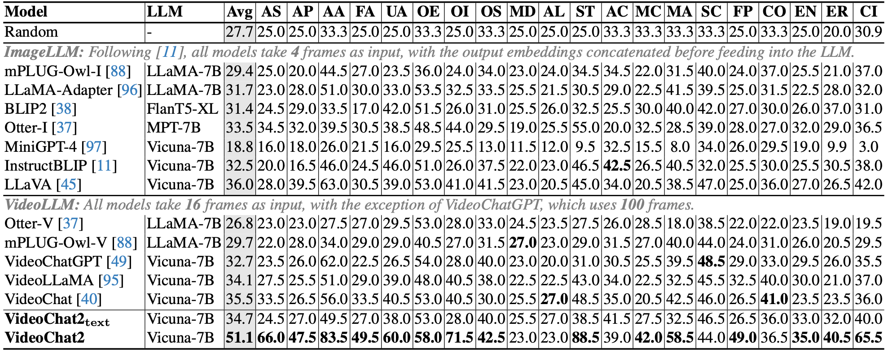
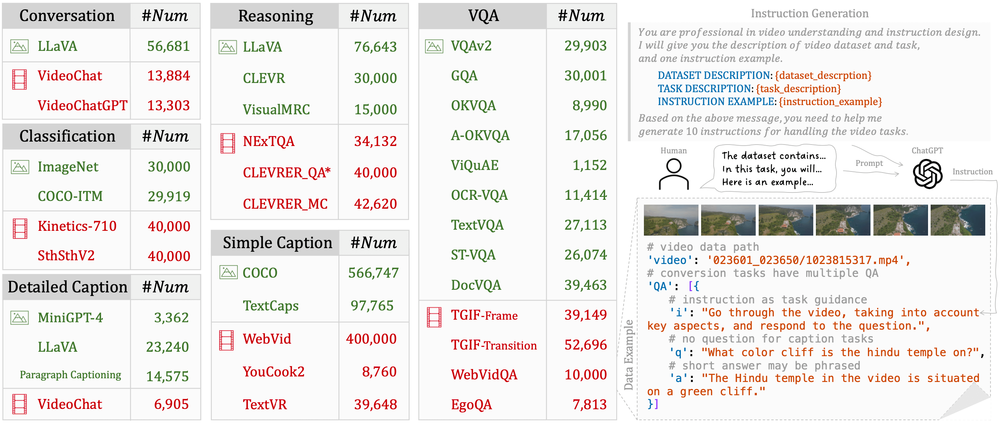

<div align="center">

<h2><a href="https://arxiv.org/abs/2311.17005">MVBench: A Comprehensive Multi-modal Video Understanding Benchmark</a></h2>

[Kunchang Li](https://scholar.google.com/citations?user=D4tLSbsAAAAJ), [Yali Wang](https://scholar.google.com/citations?user=hD948dkAAAAJ), [Yinan He](https://dblp.org/pid/93/7763.html), [Yizhuo Li](https://scholar.google.com/citations?user=pyBSGjgAAAAJ), [Yi Wang](https://scholar.google.com.hk/citations?hl=zh-CN&user=Xm2M8UwAAAAJ), [Yi Liu](https://scholar.google.com/citations?user=gGPehK4AAAAJ), [Zun Wang](https://scholar.google.com/citations?hl=zh-CN&user=G-jPT9MAAAAJ), [Jilan Xu](https://scholar.google.com/citations?user=mf2U64IAAAAJ&hl=en&oi=ao), [Guo Chen](https://chenguo.netlify.app/), [Ping Luo](https://scholar.google.com.hk/citations?user=aXdjxb4AAAAJ), [Limin Wang](https://scholar.google.com/citations?user=HEuN8PcAAAAJ) and [Yu Qiao](https://scholar.google.com/citations?user=gFtI-8QAAAAJ&hl)

</div>

[](https://arxiv.org/abs/2311.17005)
[](https://openxlab.org.cn/apps/detail/yinanhe/VideoChat2)
[](https://www.youtube.com/watch?v=OMXlbt7A2OU)
[](https://huggingface.co/datasets/OpenGVLab/VideoChat2-IT) 
[](https://huggingface.co/datasets/OpenGVLab/MVBench) 
[](https://huggingface.co/spaces/OpenGVLab/VideoChat2) 
[](https://huggingface.co/spaces/OpenGVLab/MVBench_Leaderboard) 


	
[](https://paperswithcode.com/sota/video-question-answering-on-activitynet-qa?p=mvbench-a-comprehensive-multi-modal-video)
[](https://paperswithcode.com/sota/zeroshot-video-question-answer-on-msrvtt-qa?p=mvbench-a-comprehensive-multi-modal-video)
[](https://paperswithcode.com/sota/zeroshot-video-question-answer-on-msvd-qa?p=mvbench-a-comprehensive-multi-modal-video)
[](https://paperswithcode.com/sota/zero-shot-video-question-answer-on-next-qa?p=mvbench-a-comprehensive-multi-modal-video)
[](https://paperswithcode.com/sota/zero-shot-video-question-answer-on-star-1?p=mvbench-a-comprehensive-multi-modal-video)
[](https://paperswithcode.com/sota/zero-shot-video-question-answer-on-tvqa?p=mvbench-a-comprehensive-multi-modal-video)
[](https://paperswithcode.com/sota/video-question-answering-on-next-qa?p=mvbench-a-comprehensive-multi-modal-video)
[](https://paperswithcode.com/sota/video-based-generative-performance?p=mvbench-a-comprehensive-multi-modal-video)
[](https://paperswithcode.com/sota/video-based-generative-performance-2?p=mvbench-a-comprehensive-multi-modal-video)
[](https://paperswithcode.com/sota/video-based-generative-performance-3?p=mvbench-a-comprehensive-multi-modal-video)
[](https://paperswithcode.com/sota/video-based-generative-performance-1?p=mvbench-a-comprehensive-multi-modal-video)
[](https://paperswithcode.com/sota/video-based-generative-performance-5?p=mvbench-a-comprehensive-multi-modal-video)
[](https://paperswithcode.com/sota/video-based-generative-performance-4?p=mvbench-a-comprehensive-multi-modal-video)


With the rapid development of Multi-modal Large Language Models (MLLMs), a number of diagnostic benchmarks have recently emerged to evaluate the comprehension capabilities of these models. However, most benchmarks predominantly assess spatial understanding in the static image tasks, while overlooking temporal understanding in the dynamic video tasks. To alleviate this issue, we introduce a comprehensive **M**ulti-modal **V**ideo understanding **Bench**mark, namely **MVBench**, which covers **20** challenging video tasks that cannot be effectively solved with a single frame. Specifically, we first introduce a novel static-to-dynamic method to define these temporal-related tasks. By transforming various static tasks into dynamic ones, we enable the systematic generation of video tasks that require a broad spectrum of temporal skills, ranging from perception to cognition. Then, guided by the task definition, we automatically convert public video annotations into multiple-choice QA to evaluate each task. On one hand, such a distinct paradigm allows us to build MVBench efficiently, without much manual intervention. On the other hand, it guarantees evaluation fairness with ground-truth video annotations, avoiding the biased scoring of LLMs. Moreover, we further develop a robust video MLLM baseline, i.e., **VideoChat2**, by progressive multi-modal training with diverse instruction-tuning data. The extensive results on our MVBench reveal that, the existing MLLMs are far from satisfactory in temporal understanding, while our **VideoChat2** largely surpasses these leading models by over **15%** on MVBench.

## :fire: Updates
- **2023/12/17**: Online Leaderboard:
    - We maintain an online leaderboard on [HuggingFace](https://huggingface.co/spaces/OpenGVLab/MVBench_Leaderboard).
    - Evaluation results of [GPT-4V](https://openai.com/gpt-4) and [Gemini Pro](https://deepmind.google/technologies/gemini/#introduction) are added.
- **2023/12/04**: Brief introduction:
    - :page_with_curl: [Chinese Blog](https://zhuanlan.zhihu.com/p/669658267)
    - :film_projector: [YouTube Video](https://www.youtube.com/watch?v=OMXlbt7A2OU&t=6s), [BiliBili Video](https://www.bilibili.com/video/BV1Qc411Q7Ud/)
- **2023/11/29**: Release **VideoChat2** and **MVBench**:
    - [VideoChat2](https://arxiv.org/abs/2311.17005) is a robust baseline built on [UMT](https://github.com/OpenGVLab/unmasked_teacher) and [Vicuna-v0](https://github.com/lm-sys/FastChat/blob/main/docs/vicuna_weights_version.md).
    - **1.9M** diverse [instruction data](./DATA.md) are released for effective tuning.
    - [MVBench](./MVBENCH.md) is a comprehensive benchmark for video understanding.


## :parrot: VideoChat2

### Progressive Training


**Stage1** aligns UMT-L, the visual encoder, with QFormer to efficiently compress extensive visual inputs. **Stage2** extends this connection to incorporate LLM, while **Stage3** focuses on effective instruction tuning to enhance model performance.

#### Model

|        | ViT | QFormer | LLM | LoRA | shell | Model |
|--------|:-------:|:------:|:------:|:------:|:------:|:------:|
| Stage1 | :snowflake: | :fire: | :no_entry_sign: | :no_entry_sign: | [config](./scripts/config_7b_stage1.py) & [run]((./scripts/run_7b_stage1.sh)) | [ckpt](https://pjlab-gvm-data.oss-cn-shanghai.aliyuncs.com/videochat2/umt_l16_qformer.pth) |
| Stage2 | :fire: | :fire: | :snowflake: | :no_entry_sign: | [config](./scripts/config_7b_stage2.py) & [run]((./scripts/run_7b_stage2.sh)) | [ckpt](https://pjlab-gvm-data.oss-cn-shanghai.aliyuncs.com/videochat2/videochat2_7b_stage2.pth) |
| Stage3 | :fire: | :fire: | :snowflake:| :fire: | [config](./scripts/config_7b_stage3.py) & [run]((./scripts/run_7b_stage3.sh)) | [ckpt](https://pjlab-gvm-data.oss-cn-shanghai.aliyuncs.com/videochat2/videochat2_7b_stage3.pth) |


#### [Instruction Data](./DATA.md)



#### Usage
- Prepare the envirment:
    ```shell
    pip install -r requirements.txt
    ```
- Stage1 training:
    - Download [UMT-L/16](https://pjlab-gvm-data.oss-cn-shanghai.aliyuncs.com/videochat2/l16_25m.pth) model and set `pretrained` in [stage1_config](/mnt/petrelfs/likunchang/code/mvchat/scripts/config_7b_stage1.py)
    ```shell
    bash scripts/run_7b_stage1.sh
    ```
- Stage2 training:
    - Set `vit_blip_model_path` and `llama_model_path` in [stage2_config](/mnt/petrelfs/likunchang/code/mvchat/scripts/config_7b_stage2.py)
    - For VideoBLIP, you can download Stage1 [model](https://pjlab-gvm-data.oss-cn-shanghai.aliyuncs.com/videochat2/umt_l16_qformer.pth)
    - For LLM, please follow [here](https://github.com/OpenGVLab/Ask-Anything/tree/main/video_chat#running-usage) to prepare vicuna-7b-v0
    ```shell
    bash scripts/run_7b_stage2.sh
    ```
- Stage3 training:
    - Download [instruction data](./DATA.md) and set `data_dir` in [instruction_data.py](configs/instruction_data.py)
    - Set `vit_blip_model_path`, `llama_model_path` and `videochat2_model_path` in [stage3_config](/mnt/petrelfs/likunchang/code/mvchat/scripts/config_7b_stage3.py)
    - You can download Stage2 [model](videochat2_model_path) and create instruction data for your own tuning
    ```shell
    bash scripts/run_7b_stage3.sh
    ```

- Runing demo:
    - Jupyter Notebook: [demo.ipynb](demo.ipynb)
    - Gradio:
    ```shell
    # Set the related model path in configs/config.json and demo.py
    python demo.py
    ```

- Evaluation:
    - **MVBench**: [mvbench.ipynb](mvbench.ipynb)
    - For VideoChatGPT Benchmark, we follow the original [repo](https://github.com/mbzuai-oryx/Video-ChatGPT/tree/main/quantitative_evaluation) and use ChatGPT-3.5 to evalute the performances.
    - For NExT-QA, STAR and TVQA, we follow [SeViLA](https://github.com/Yui010206/SeViLA/blob/main/sevila_data/Data%20Preprocess.ipynb) to prepare the data. And we simple modify [mvbench.ipynb](mvbench.ipynb) and directly output the options to calculate the accuracy.

## :bar_chart: [MVBench](./MVBENCH.md)

We propose a comprehensive video understanding benchmark with **20** challenging video tasks, where our **VideoChat2** secures the top ranking on **15** tasks. More details can be found [here](./MVBENCH.md).


# :page_facing_up: Citation

If you find this project useful in your research, please consider cite:
```BibTeX
@article{2023videochat,
  title={VideoChat: Chat-Centric Video Understanding},
  author={KunChang Li, Yinan He, Yi Wang, Yizhuo Li, Wenhai Wang, Ping Luo, Yali Wang, Limin Wang, and Yu Qiao},
  journal={arXiv preprint arXiv:2305.06355},
  year={2023}
}

@misc{li2023mvbench,
      title={MVBench: A Comprehensive Multi-modal Video Understanding Benchmark}, 
      author={Kunchang Li and Yali Wang and Yinan He and Yizhuo Li and Yi Wang and Yi Liu and Zun Wang and Jilan Xu and Guo Chen and Ping Luo and Limin Wang and Yu Qiao},
      year={2023},
      eprint={2311.17005},
      archivePrefix={arXiv},
      primaryClass={cs.CV}
}
```

# :dizzy: Acknowledgement

Thanks to the open source of the following projects:

[InternVid](https://github.com/OpenGVLab/InternVideo), [UMT](https://github.com/OpenGVLab/unmasked_teacher), [MiniGPT-4](https://github.com/Vision-CAIR/MiniGPT-4), [LLaVA](https://github.com/haotian-liu/LLaVA), [BLIP2](https://huggingface.co/docs/transformers/main/model_doc/blip-2), [VideoChatGPT](https://github.com/mbzuai-oryx/Video-ChatGPT/tree/main), [Vicuna](https://github.com/lm-sys/FastChat/tree/main), [M3-IT](https://m3-it.github.io/).
