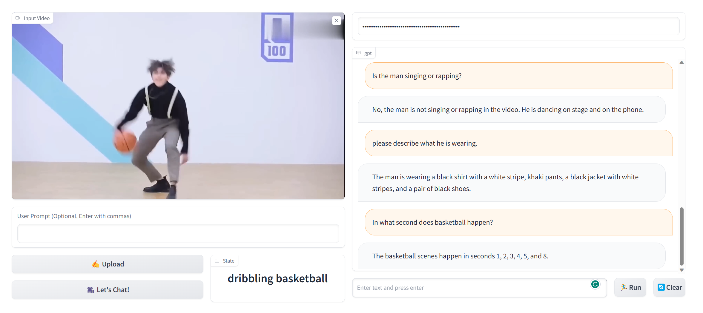

# VideoChat

VideoChat is a multifunctional video question answering tool that combines the functions of Action Recognition, Visual Captioning and ChatGPT. Our solution generates dense, descriptive captions for any object and action in a video, offering a range of language styles to suit different user preferences. It supports users to have conversations in different lengths, emotions, authenticity of language.
- Video-Text Generation
- Chat about uploaded video
- Interactive demo

# :fire: Updates

- **2023/04/19**: Code Release

# :speech_balloon: Example





# :running: Usage

```shell
# We recommend using conda to manage the environment and use python3.8.16  
conda create -n chatvideo python=3.8.16  
conda activate chatvideo  
  
# Clone the repository:  
git clone https://github.com/OpenGVLab/Ask-Anything.git  
cd ask-anything/video_chat_with_ChatGPT
  
# Install dependencies:  
pip install -r requirements.txt  
pip install https://github.com/explosion/spacy-models/releases/download/en_core_web_sm-3.0.0/en_core_web_sm-3.0.0.tar.gz  
python -m pip install 'git+https://github.com/facebookresearch/detectron2.git'  
  
# Download the checkpoints  
mkdir pretrained_models  
wget -P ./pretrained_models https://huggingface.co/spaces/xinyu1205/Tag2Text/resolve/main/tag2text_swin_14m.pth  
wget -P ./pretrained_models https://datarelease.blob.core.windows.net/grit/models/grit_b_densecap_objectdet.pth  
git clone https://huggingface.co/mrm8488/flan-t5-large-finetuned-openai-summarize_from_feedback ./pretrained_models/flan-t5-large-finetuned-openai-summarize_from_feedback  
cd ./pretrained_models/flan-t5-large-finetuned-openai-summarize_from_feedback  
git lfs pull  
cd ../..  
  
# Configure the necessary ChatGPT APIs  
export OPENAI_API_KEY={Your_Private_Openai_Key}  
  
# Run the VideoChat gradio demo.  
python app.py  
```

# Acknowledgement

The project is based on [InternVideo](https://github.com/OpenGVLab/InternVideo), [Tag2Text](https://github.com/xinyu1205/Tag2Text), [GRiT](https://github.com/JialianW/GRiT), [mrm8488](https://huggingface.co/mrm8488/flan-t5-large-finetuned-openai-summarize_from_feedback) and [ChatGPT](https://openai.com/blog/chatgpt). Thanks for the authors for their efforts.

